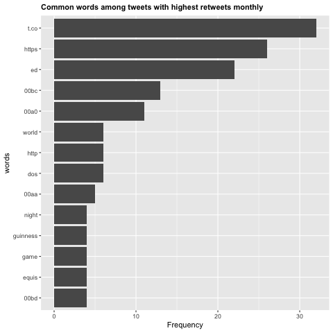

For this project we were interested in exploring twitter data on beer companies. Our inital thought was to look at twitter marketing aimed toward youth. With limited access to age data from twitter (a paid data source) we redefined our questions listed below.

# Process

We choose 5 brands of beer from different multinational companies around the world for our analysis.Budlight, Dos Equis, Guinness U.S., Blue Moon and Tsingtao. Each of us cleaned the data for our assigned beer companies and we merged our clean data. Our data wrangleing file was sent to you separately due to twitter authorization code privacy.

# Our data visualization files answering our respective questions above are attached:

* The only file you need to run is the makefile.R

# Questions

1. Derrick, Sentiment Analysis by day of the week, Does sentiment analysis change over the course of the week by each beer company?

Here is the density of sentiment scores for all beer companies. As we see, the vast majority of sentiments are positive, which makes sense for the alcohol industry. However, once we break it down per individual company, we see that they differ a little bit. Most notable, is how much more positive the Blue Moon tweets are than every other company. Also interesting to note that the positivity does not increase that significantly as the week approaches the weekend. This significance could be tested with a linear regression model.

)

)

)

2. Michael, Thematic Topic Modeling, What are the most popular topics overall? 

3. Tess, What are the most popular topics on Saturdays across the 5 companies? 

4. Lisha, Among the highest retweets each month, which are the most popular words? 

Below is the popular words among tweets with highest retweets in each month:

5. David, What are the most frequently used words by each company?

